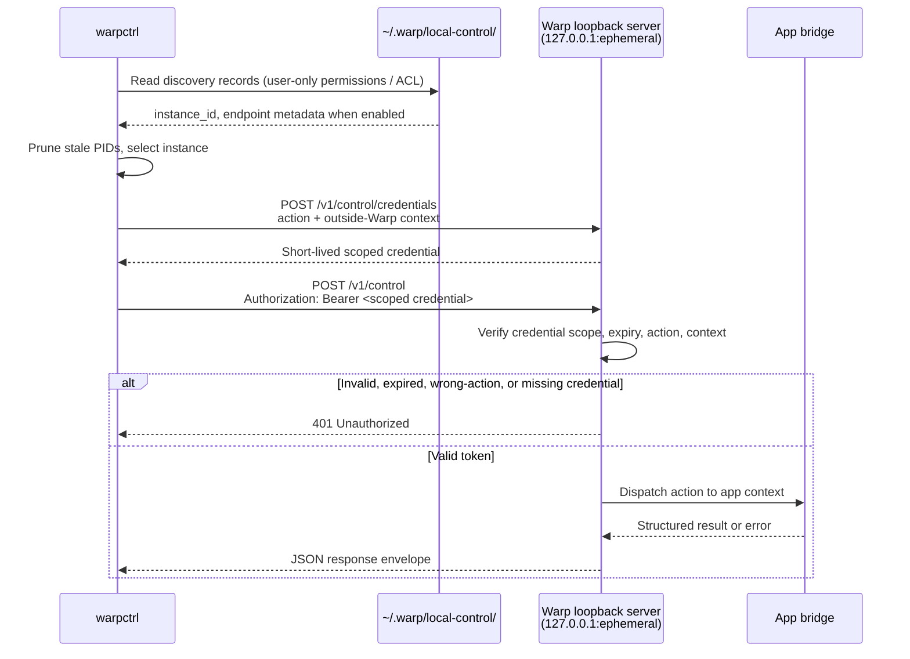

# warpctrl operator README
`warpctrl` is the provisional standalone CLI for controlling an already-running local Warp app instance. It is intended for scripts, demos, agent workflows, and developer automation that need to perform allowlisted Warp UI actions without launching the GUI executable in CLI mode.
The first implementation slice is intentionally narrow:
- discover compatible running Warp instances;
- select one instance implicitly when unambiguous or explicitly with `--instance`;
- request short-lived scoped credentials from the selected app before sending authenticated local-control requests;
- create a new terminal tab with `warpctrl tab create`.
The local-control protocol and catalog are broader than this slice, but commands outside the implemented capability set should fail with structured unsupported-action errors until their handlers land.
## Packaging model
`warpctrl` should be packaged as a separate CLI artifact from the Warp GUI app while reusing shared repository code:
- `crates/local_control` owns discovery records, scoped local authentication material, client transport, protocol envelopes, action names, and error types.
- `crates/warp_cli` owns command parsing conventions for local-control subcommands.
- the app-side bridge owns the per-process loopback listener and dispatches supported actions onto the live Warp UI context.
The binary should initialize only CLI parsing, instance discovery, local authentication loading, request serialization, HTTP transport, and output formatting. It should not initialize GUI state, terminal models, rendering, workspaces, or main-app startup paths.
During the provisional naming period, release artifacts and helper names may be channelized, but operator docs and examples should use `warpctrl` unless an integration branch explicitly documents a channel-specific alias.
This branch wires the standalone binary target and the macOS/Linux bundle-script artifact selectors:
- `cargo build -p warp --bin warpctrl`
- `script/macos/bundle --artifact warpctrl ...`
- `script/linux/bundle --artifact warpctrl ...`
Windows has the native Rust binary target, but installer/release helper exposure remains follow-up packaging work.
## Install and invocation guidance
### macOS
Build locally with `cargo build -p warp --bin warpctrl`, then run `target/debug/warpctrl` or copy/symlink that binary onto `PATH`.
For distributable standalone artifact checks, use `script/macos/bundle --artifact warpctrl` with the desired channel/signing flags. The bundle script writes a standalone `warpctrl` binary into its macOS artifact output directory instead of embedding it in the GUI app bundle.
### Linux
Build locally with `cargo build -p warp --bin warpctrl`, then run `target/debug/warpctrl` or copy/symlink that binary onto `PATH`.
For distributable standalone artifact checks, use `script/linux/bundle --artifact warpctrl` with the desired channel/package selection. The Linux bundle script routes packaging through the standalone control-binary artifact path; downstream package installation should place the emitted `warpctrl` binary according to that package format.
Run `warpctrl --version` after installation to confirm the shell is resolving the expected build.
### Windows
Build locally with `cargo build -p warp --bin warpctrl`, then run `target\debug\warpctrl.exe` or copy that binary onto `PATH`.
The Windows-native binary target exists in this slice. Installer helper creation and release-artifact wiring still need a later packaging change before docs can promise an installer-provided `warpctrl` command.
## End-to-end local test flow
Use matching app and CLI bits from the same branch or release artifact so the protocol version and action catalog agree.
1. Start Warp and leave at least one window open.
2. Confirm that the local-control server registered the running process:
   ```bash
   warpctrl instance list
   ```
3. If exactly one compatible instance is listed, create a new terminal tab:
   ```bash
   warpctrl tab create
   ```
4. If multiple compatible instances are listed, copy the desired `instance_id` and target it explicitly:
   ```bash
   warpctrl tab create --instance <instance_id>
   ```
5. Verify the running app receives focus for the selected instance and a new terminal tab appears according to Warp's normal new-tab placement behavior.
6. In a future slice that implements `tab list`, inspect state before and after the mutation:
   ```bash
   warpctrl tab list --instance <instance_id>
   ```
Expected failures:
- no running compatible app: exits non-zero with a no-instance error;
- multiple ambiguous instances: exits non-zero and asks for `--instance`;
- unsupported app build or stale discovery record: exits non-zero with a protocol, stale-target, or transport error;
- `tab.create` not yet implemented by the running app bridge: exits non-zero with an unsupported-action error.
## Security model
The local-control protocol is designed for same-user scripting, not cross-user or network access. The trust boundary is the local user account.
- **Loopback-only listener.** Each Warp process binds its control server to `127.0.0.1` on an ephemeral port. The listener is not reachable from the network.
- **Scoped credential issuance.** Discovery records never contain raw bearer tokens. A client selects an instance from discovery metadata, requests an outside-Warp credential for a specific action, and presents that short-lived scoped credential to the control endpoint. Missing, invalid, expired, wrong-action, or insufficient credentials are rejected before selector resolution or handler dispatch.
- **Disabled discovery is non-actionable.** Outside-Warp control defaults off. While it is disabled, discovery records either are absent or contain only non-actionable disabled status; they do not expose endpoint authority or credential broker metadata.
- **File-permission-gated discovery.** Discovery records are stored in a per-user local-control directory. On POSIX platforms, files must be created with owner-only permissions. On Windows, records must be stored under the current user's app data directory with an ACL that grants access only to the current user, Administrators, and SYSTEM.
- **Stale-record pruning.** On each `instance list` or implicit discovery call, records whose PID is no longer alive are ignored or deleted automatically.
- **No CORS.** The control endpoints do not set permissive CORS headers, so browser-origin JavaScript cannot read responses even if it guesses the port. Scoped credentials provide a second layer because browsers cannot obtain credentials through discovery records.

**Known limitations and future hardening:**
- This foundation slice keeps raw credential authority in app-owned process memory and does not write it to discovery records. Platform secure storage for authoritative enablement and credential material remains future hardening before public shipment.
- Scoped credentials are intentionally short-lived and action-specific, but this remains a same-user safety boundary rather than strong isolation from arbitrary compromised same-user software.
- Windows local-control authentication is not complete until discovery-record ACL creation and validation are implemented.
- Once higher-risk handlers land (e.g. `input.insert`, command execution), the same-user boundary becomes a code-execution trust boundary. Consider separating the token from the discovery metadata, adding per-request nonces, or switching to a Unix domain socket with `SO_PEERCRED` for kernel-verified caller identity.
## Documentation review notes
- Treat `warpctrl` as provisional executable naming until packaging signs off on final artifact aliases.
- Keep examples scoped to discovery and `tab create` until additional app-side handlers are implemented.
- Do not document catalog commands as usable just because they exist in protocol enums or parser scaffolding; operator docs should distinguish implemented commands from planned allowlist entries.
- Windows packaging may initially follow the existing helper-wrapper pattern rather than shipping a native standalone executable. Update this README when that decision is final.
